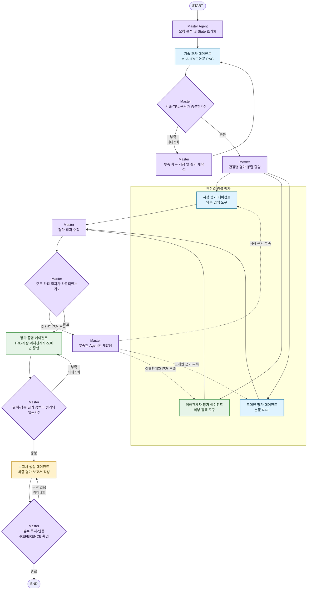

# Subject

본 프로젝트는 KV cache 최적화 기술을 소프트웨어, 하드웨어 두 진영에서 선정하여,
시장·이해관계자·도메인 관점에서 평가하는 Agentic RAG를 개발하는 프로젝트 임.

## Overview

- Objective : 하나의 기술을 복수 관점에서 비교 평가
- Method : Multi-Agent(Distributed) + Agentic RAG
- Tools : LangGraph, FAISS + BM25(RRF 융합), Tavily Web API, pdfplumber (2단 레이아웃·표 좌표 처리를 위해 pypdf 대신 채택)

## Selected Technologies

- SW : **DeepSeek-V2 MLA** (Multi-head Latent Attention, arXiv 2405.04434) — Key·Value를 저차원 잠재 벡터로 압축하도록 어텐션 구조 자체를 재설계한 기술로, 원문 보고 기준 KV cache 93.3% 감소. DeepSeek-AI가 최초 실증한 이후 후속 모델과 AWS Bedrock, NVIDIA NIM 등 상용 추론 생태계에서 지속 채택되어 공개 정보 기준 TRL 9에 근접한 실제 운용 기술로 판단해 선정
- HW : **ITME** (CXL-Hybrid 계층 메모리 확장, arXiv 2606.12556, SK hynix) — CXL 기반 DRAM-NVMe Hybrid Memory로 TB급 원격 메모리 계층을 구성하고, 모델 가중치와 prefix KV cache의 예측 가능한 접근 패턴을 활용해 데이터를 미리 이동시키는 기술로, 데이터센터·클라우드 LLM 서빙의 확장성과 처리 효율 향상이 기대되어 선정

## Features

- PDF 자료 기반 정보 추출 : RAG 적재 문서 4편(DeepSeek-V2/MLA, ITME, InfiniGen, CXL-PNM 원문 논문, 총 96p ≤ 200p 예산) 페이지 단위 파싱 및 인용 `[n, p.X]` 지원
- Dense(FAISS) + BM25 하이브리드 검색을 RRF로 융합하고, 기술별 문서 필터로 다른 기술 수치 혼입 방지
- Agentic RAG 파이프라인 : 질의 계획(한국어→영어 기술어) → 검색 → 관련성 판정 → 관련 청크 2개 미만 시 질의 재작성 후 재검색(최대 2회) → 근거 기반 답변, 근거 없으면 "근거 부족" 명시
- 확증 편향 방지 전략 : HW 베이스라인 문서(InfiniGen, CXL-PNM)로 선정 기술(ITME)의 한계를 제3의 시각에서 교차 확인, SW·HW 두 기술을 동일 형식(쟁점/관점 A 평가/관점 B 평가/이유)으로 병기, 평가 종합 에이전트는 새로운 자료를 검색하지 않고 앞 단계에서 검증된 Evidence만 사용

## Tech Stack

- Framework : LangGraph
- LLM/Generator : {GPT version}
- LLM/Judge : {GPT version}
- Retrieval : FAISS(Dense) + BM25(Sparse), RRF 순위 융합 - {Hit Rate@K}, {MRR}
- Embedding : Qwen3-Embedding-0.6B (다국어·교차언어 검색, 최대 32K 토큰, Apache 2.0 라이선스)

## Agents

- Master Agent : 전체 작업 분배 및 실행 제어. State를 확인해 다음 Agent를 선택하고 병렬 실행·결과 수집·근거 부족 재실행·종료 여부를 결정
- 기술 조사 에이전트 (RAG) : 원문에서 MLA와 ITME의 기술 개요, 적용 범위, 성능, 한계 및 TRL 판단 근거 추출
- 시장 평가 에이전트 (웹 검색) : 시장 규모, 상용화·채택 사례, 성장 전망 및 생태계 지원 현황 검색
- 이해관계자 평가 에이전트 (웹 검색) : 경쟁사 반응, 개발자 평가, 도입 기업 의견, 투자·업계 시각 조사
- 도메인 평가 에이전트 (RAG) : 데이터센터·클라우드 장문맥 서빙 환경에서 D1~D7 공통 기준으로 MLA와 ITME의 적합성 평가
- 평가 종합 에이전트 : 기술 성숙도·시장·이해관계자·도메인 평가의 일치점과 상충 지점을 근거 중심으로 종합 (신규 검색 없이 기존 Evidence만 사용)
- 보고서 생성 에이전트 : 검증된 단계별 결과와 Evidence를 연결해 SUMMARY부터 REFERENCE까지 최종 평가 보고서 생성

## Architecture



※ 설계 산출물 PDF(D-2. Graph 흐름 설계) 원본 flowchart 이미지를 Mermaid로 옮긴 것으로, 노드 문구는 원본 이미지를 기준으로 최대한 그대로 옮겼으며 세부 배치·색상은 Mermaid 렌더링 방식에 따라 원본과 다를 수 있음


## Directory Structure

```text
kv-cache-optimization/
├── data/                    # 문서 풀
├── data/
│   ├── manifest.json        # RAG 적재 문서 4편 메타데이터(진영/역할/참고문헌 시작 페이지 등)
│   ├── raw/                 # 원문 PDF (git 미포함, 로컬에 직접 배치)
│   └── processed/           # 전처리 결과 (chunks.jsonl, summary.json)
├── preprocessing/           # 데이터 전처리 (파싱·참고문헌 제외·청킹·페이지 예산 검증)
├── agents/                  # Agent 모듈
├── prompts/                 # 프롬프트 템플릿
├── prompts/                 # Agent 프롬프트 패키지 (00_common_contract 등)
├── schemas/                 # Evidence 등 공통 JSON Schema
├── scripts/                 # 프롬프트 패키지 정적 검증 스크립트
├── src/kv_eval/             # 백엔드 패키지 (src 레이아웃)
│   ├── config.py / state.py / graph.py / llm.py
│   ├── agents/              # master, technology, market, stakeholder, domain, synthesis, report
│   ├── rag/                 # ingest, index, retrieve, workflow
│   ├── tools/                # web_search.py
│   └── reporting/            # sections, export
├── tests/
├── outputs/                 # 평가 결과 저장
├── app.py                   # 실행 스크립트
├── pyproject.toml
└── README.md
```


## Usage


```bash
pip install -e .          # pyproject.toml (langgraph, openai, tavily-python, faiss-cpu, rank-bm25 등)
pip install -r requirements.txt   # 전처리 전용 (pdfplumber, chromadb 등)
```

**2. 환경변수 설정**

`.env.example`을 복사해 `.env`를 만들고 키를 채운다.

```bash
cp .env.example .env
```

```text
OPENAI_API_KEY=          # 필수
OPENAI_MODEL=gpt-5.6-sol # 고정값, 다른 모델로 바꾸면 즉시 에러
TAVILY_API_KEY=          # 필수
PAPERS_DIR=data/raw      # 원문 PDF 4편이 있는 경로
OUTPUT_DIR=outputs
```

**3. 원문 PDF 배치**

`data/manifest.json`에 정의된 파일명대로 `data/raw/`에 4편을 넣는다 (`deepseek_v2_mla.pdf`, `itme.pdf`, `infinigen.pdf`, `cxl_pnm.pdf`).

**4. 실행**

```bash
python {app.py}
python app.py
```

## Contributors

이름 | 수행 역할 |
|---|---|
| 김동욱(P280) |  전체 시스템 아키텍처 설계 — LangGraph 기반 State(state.py)·Graph 노드/엣지 배선(graph.py), 실행 설정(config.py) 등 전체 골격 구성  |
| 김민정(P282) |  데이터 전처리 — 논문 PDF 파싱, 2단 컬럼 분리, 참고문헌 구간 제외, 청킹 파이프라인 구현(preprocessing/)  |
| 김태동(P287) |  API 툴 정리 — 시장·이해관계자 평가 Agent용 Tavily 웹 검색 도구 구현(tools/web_search.py)  |
| 박규리(P289) |  데이터 전처리(파싱·참고문헌 구간 제외·청킹), 임베딩·벡터 색인, 검색 품질 평가 세트 및 하네스 |
| 이재겸(P298) |  페르소나 및 프롬프트 작성 — Agent별 System/Task 프롬프트 패키지(prompts/), 공통 계약·Evidence 스키마 설계  |
| 임동건(P301) |  vector DB 구성(박규리님과 공동) — Chroma 기반 벡터DB 셋업(vectordb.py, data/chroma/) |
