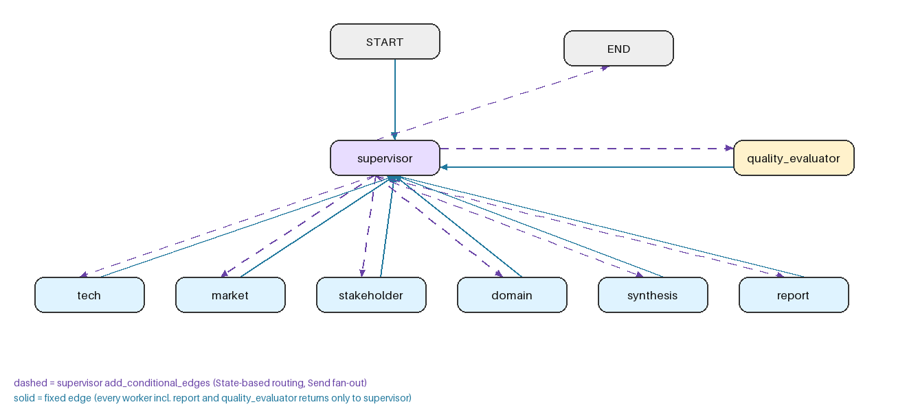
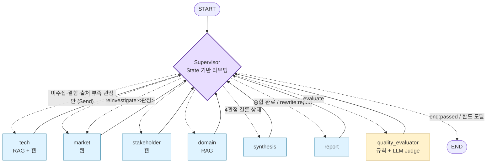

# Subject

KV cache 최적화 기술을 소프트웨어(DeepSeek-V2 MLA)와 하드웨어(ITME) 진영에서 하나씩 골라, 기술 성숙도(TRL)·시장성·이해관계자·도메인 적용성 4관점에서 근거 중심으로 평가하는 Supervisor 패턴 Multi-Agent 시스템.

## Overview

- Objective : 두 기술을 4관점에서 비교 평가한다. 우승 기술을 고르지 않고 관점별 장점·제약·근거 수준·도입 전 확인사항을 근거와 함께 제시한다.
- Method : Multi-Agent(Supervisor) + Agentic RAG + 웹 검색
- Tools : LangGraph(StateGraph, `Send`, `astream`, AsyncSqliteSaver), FAISS + BM25(RRF), Tavily, LangSmith, pdfplumber
- **Pattern : Supervisor** — `supervisor` 노드 하나가 State를 읽고 `add_conditional_edges` 하나로 다음 노드를 고른다. 보고서·품질 평가 노드를 포함한 모든 작업 노드는 실행 후 Supervisor로만 돌아온다(작업 노드 간 직접 엣지 0개, `tests/test_graph_structure.py`에서 검사). Supervisor는 LLM이 아니라 결정적 규칙 함수다(`src/kv_eval/supervisor/policy.py`, 명세 `docs/SUPERVISOR_POLICY.md`).
- **선정 이유** : 이 과제의 핵심은 "관점별 근거가 충분한지 판단하고 부족한 관점만 다시 조사한다"와 "품질 평가 미달 원인에 따라 다른 에이전트로 되돌린다"는 두 루프다. 단계 체인은 순서가 엣지에 묶여 특정 관점만 다시 부를 수 없다. Orchestrator-Workers는 오케스트레이터가 매번 작업을 새로 쪼개고 Synthesizer가 합치는 구조인데, 평가 틀이 4관점·D1~D7로 이미 정해진 이 과제에서는 분해가 실행마다 달라져 재현이 어렵고, "어느 관점이 부족한가"를 판정하는 루프는 따로 만들어야 한다. State 전체를 한 곳에서 보고 다음 노드를 정하는 Supervisor가 두 루프를 가장 직접 구현한다.
- **동적 처리** : 실행 순서를 고정하지 않는다. Supervisor는 매 진입마다 `perspective_status`·`node_status`·`retry_counts`·`followup_counts`·`eval_result`·`step_count`만 보고 결정한다.
  - 미수집 관점을 `Send`로 한 번에 할당한다. 기술 조사 결과를 다른 관점이 입력으로 쓰지 않으므로 선행 순서가 없다. 실행은 `AGENT_CONCURRENCY`(기본 1)만큼만 동시에 돈다.
  - 판정을 막는 결함(검색 결과·인용 없음, 기준 판정 불가, TRL 미기재 등)이 있거나 기술별 고유 출처가 2개 미만인 관점만 다시 부른다. 에이전트가 적은 세부 미확인 항목은 재조사 사유가 아니라 보고서 한계점에 남는다. 재작업 지시(사유와 기술별 검색 힌트)는 RAG 질의 계획·캐시 키·에이전트 프롬프트에 반영된다.
  - 종합 에이전트가 특정 관점의 추가 근거를 요구하면 그 관점만 다시 조사한다(충분성 재조사와 별도의 후속 한도).
  - 보고서가 정상 완료되면 Supervisor가 품질 평가 노드를 부른다. 미달 시 원인으로 경로를 나눈다: 원인이 관점 에이전트(편향·커버리지, 또는 에이전트 판정을 옮긴 표의 근거 결함)면 `reinvestigate:<관점>`, 보고서 서술이면 `rewrite:report`.
  - 에이전트 예외는 `node_status=failed`로 기록하고 재시도한다. 한도를 넘으면 제외하고 근거 공백으로 보고서에 적는다.
  - 종료 조건은 근거 충분성과 품질 평가 통과다. `MAX_STEPS`·재시도 한도·`recursion_limit`은 안전장치이며, 상한에 닿아도 근거 공백을 적은 보고서를 만들고 정상 종료한다.
  - 모든 결정은 사유와 함께 `outputs/decisions_{trace_id}.jsonl`과 LangSmith(metadata `trace_id`)에 남는다.

## Selected Technologies

- SW : **DeepSeek-V2 MLA** (Multi-head Latent Attention, arXiv 2405.04434) — Key·Value를 저차원 잠재 벡터로 압축하도록 어텐션 구조를 재설계한 기술. 저자 보고 기준 KV cache 93.3% 감소. vLLM·SGLang 등 서빙 프레임워크가 MLA 백엔드를 지원하고 DeepSeek-V3·R1이 같은 구조를 쓴다.
- HW : **ITME** (CXL-Hybrid 계층 메모리 확장, arXiv 2606.12556, SK hynix) — CXL 기반 DRAM-NVMe Hybrid Memory로 TB급 원격 메모리 계층을 구성하고, 가중치와 prefix KV cache의 예측 가능한 접근 패턴을 이용해 데이터를 미리 옮긴다.
- HW 베이스라인 : InfiniGen, CXL-PNM — ITME의 한계를 제3의 시각에서 교차 확인하는 용도로만 RAG에 넣는다.

## Features

- PDF 자료 기반 정보 추출 : 논문 4편(96p) 페이지 단위 파싱, 인용 `[n, p.X]`
- Agentic RAG : 질의 계획 → 하이브리드 검색 → 관련성 판정 → 관련 청크 2개 미만이면 질의 재작성(최대 2회) → 근거 기반 답변. 근거가 없으면 "근거 부족"
- Supervisor 동적 라우팅 : 부족한 관점만 재조사, 평가 미달 원인별 재작업, 실패 fallback, 체크포인트 재개(`--resume`)
- **확증 편향 방지 전략**
  - HW 베이스라인 문서(InfiniGen, CXL-PNM)로 ITME의 한계를 교차 확인한다.
  - 두 기술을 같은 형식(쟁점 / 관점 A / 관점 B / 엇갈리는 이유)으로 병기한다. 신호표·판정표·증거 균형표는 LLM이 아니라 코드가 State의 판정값으로 만든다.
  - 종합 에이전트는 새로 검색하지 않고 검증된 Evidence만 쓴다.
  - 편향 통제 규칙 : 기술·관점별 고유 출처 2개 이상(논문은 문서 단위), 웹 근거의 단일 발행처 비중 60% 이하, 판정이 긍정·우려 한쪽뿐이면 반대 방향 근거를 다시 찾는다. 원문 1편에만 기댄 도메인 '적합' 판정은 '조건부'로 낮춘다. 포럼·개인 블로그는 개발자 반응의 보조 근거로만 쓴다.
- **보고서 품질 평가 (Hybrid)** : 보고서 다음에 독립 노드 `quality_evaluator`가 4항목을 각각 판정한다. 규칙 검사에서 실패한 항목은 LLM Judge가 통과로 뒤집지 못한다.

  | 항목 | 규칙 검사 | LLM Judge (`EvalVerdict`) | 미달 시 |
  |---|---|---|---|
  | Groundedness | 목차·인용·REFERENCE 검증, 수치 문장 인용 필수, 설계 문서 `[D]`는 1·2장에만, PDF 10p 이하 | 발췌가 주장을 뒷받침하는가 | 원인이 보고서면 재작성, 에이전트 판정 표면 그 관점 재조사 |
  | 중립성 | 두 기술 간 우열·추천·지시 표현 탐지 | 암묵적 우열 판정 | 위와 같음 |
  | 편향 통제 | 고유 출처 수, 단일 발행처 비중, 긍정·우려 양방향 | 한쪽 근거 편중 | 원인 관점 재조사 |
  | 관점 커버리지 | 4.1~4.4 서술·판정표, 두 기술 모두 기재 | 4관점 실질 서술 | 원인 관점 재조사 |

  항목별 `passed / score(1~5) / reason / target_agents`가 State의 `eval_result`와 `outputs/validation.json`에 남는다.

## Tech Stack

| Category | Details |
|---|---|
| Framework | LangGraph 1.x (StateGraph, `Send`, `add_conditional_edges`), Python 3.11+ |
| Execution | 비동기 실행(`astream`). 작업 노드는 `async def`, 블로킹 SDK 호출은 `asyncio.to_thread`. 관점 에이전트는 `AGENT_CONCURRENCY`(기본 1)만큼 동시 실행 |
| Checkpoint | langgraph-checkpoint-sqlite `AsyncSqliteSaver` (thread_id = trace_id) |
| Observability | LangSmith (run `kv-eval-supervisor`, tag `pattern:supervisor`, metadata `trace_id`), 결정 로그 JSONL |
| LLM / Generator | gpt-5.6-terra (OpenAI Responses API, Pydantic 구조화 출력) |
| LLM / Judge | gpt-5.6-terra (품질 평가 `EvalVerdict`) |
| Retrieval | FAISS(Dense) + BM25(Sparse), RRF 융합, 기술별 문서 필터 — 92케이스 **Hit@1 0.84 / Hit@3 0.99 / Hit@6 1.00 / MRR 0.92** (`outputs/retrieval_eval.json`) |
| Embedding | Qwen3-Embedding-0.6B. 문서 임베딩은 처음 한 번만 계산해 `data/cache/index/`에 저장하고 재사용 |
| Web Search | Tavily (시장·이해관계자 근거, TRL 7~9 상용화 근거) |
| Test | pytest + Fake LLM·Web·RAG (API 키 없이 실행) |

## Agents

조정 계층(`src/kv_eval/supervisor/`, `src/kv_eval/evaluation/`)과 하위 에이전트(`src/kv_eval/agents/`)를 분리했다. 하위 에이전트는 Supervisor를 import하지 않는다.

- **Supervisor** : State 제어 필드로 다음 노드 결정(`policy.decide`), 결정 로그 기록, 재시도·제외·종료 판단
- **Quality Evaluator** : 보고서 4항목 Hybrid 평가(규칙 + LLM Judge), 미달 원인 에이전트 지정
- `tech` (RAG + 웹) : MLA·ITME 기술 개요·성능·한계, TRL 판정(논문 → 1~6, 상용화 웹 근거 → 7~9)
- `market` (웹) : 시장 규모·성장, 상용화·채택, 생태계 지지(M1~M3, 긍정/우려/혼재)
- `stakeholder` (웹) : 경쟁 진영·도입 기업/개발자·투자 업계의 귀속된 발언(S1~S3)
- `domain` (RAG) : 데이터센터·클라우드 장문맥 서빙 D1~D7(적합/조건부/제약/근거 부족)
- `synthesis` : 4관점의 일치·상충·근거 공백 정리. 새로 검색하지 않고, 추가 근거가 필요한 관점을 지목할 수 있다
- `report` : SUMMARY~REFERENCE 보고서. 판정표·증거 균형표·근거 공백 절은 코드가 만든다

## State Schema

`src/kv_eval/state.py`. 제어 필드와 페이로드를 나눈다.

| 구분 | 필드 | reducer |
|---|---|---|
| 제어 | `trace_id`, `step_count`, `next_agents`, `status` | 단일 작성자(Supervisor) |
| 제어 | `perspective_status`, `node_status`, `retry_counts`, `followup_counts`, `last_error`, `feedback` | 키 단위 dict merge |
| 제어 | `eval_result`, `last_decision` | 단일 작성자 |
| 제어 | `gaps` (`Gap`: 관점·기술·종류·사유) | 중복 제거 append |
| 페이로드 | `perspectives{tech, market, stakeholder, domain}` (`PerspectiveResult`) | 키 단위 dict merge |
| 페이로드 | `synthesis`, `report` | 단일 작성자 |
| 페이로드 | `evidence` | 에이전트 단위 교체 + dedup, 발췌 160자 + `excerpt_ref` |
| 페이로드 | `cache_keys` | 키 단위 dict merge |

1. **제어 vs 페이로드 분리** : Supervisor는 제어 필드와 결과의 `sufficient`·`missing`만 읽는다. 라우팅이 결과 본문 구조에 묶이지 않아 프롬프트를 바꿔도 라우팅은 그대로다.
2. **관측성 위치** : 결정 로그 본문은 `outputs/decisions_{trace_id}.jsonl`과 LangSmith에 두고, State에는 직전 결정(`last_decision`)만 둔다. State에 쌓으면 체크포인트마다 전체 이력이 복제된다.
3. **지속성 비용** : RAG 캐시와 Evidence 발췌 원문은 `data/cache/{trace_id}/`에 두고 State에는 160자 축약본과 참조만 둔다. 보고서·평가는 원문을 `hydrate()`로 읽는다. `Send` 페이로드에도 에이전트가 읽는 제어 필드만 넘긴다. 에이전트를 다시 실행하면 이전 시도의 근거는 교체한다.

   | 실측 (실제 실행 1회, trace `77cb99ef`) | 크기 |
   |---|---|
   | 최종 State (`final_state.json`) | 213 KB |
   | 그중 `evidence` 119건 | 70 KB |
   | 디스크 저장소 (`data/cache/{trace_id}/`, 원문·RAG 캐시) | 317 KB |
   | 체크포인트 23개 누적 (`checkpoints.sqlite`) | 3.38 MB |

   원문을 State에 두면 evidence만 약 490 KB가 되고 체크포인트마다 그대로 복제된다. `python scripts/measure_state_size.py`로 Fake 실행 기준 크기를 다시 잴 수 있다. 원문 저장소가 없는 환경(새로 clone)에서는 축약 발췌만 남는데, 이때는 `excerpt_truncated`를 표시하고 Judge 프롬프트와 `validation.json`에 경고를 남긴다. `--report-only`는 원문이 없으면 즉시 실패한다.
4. **상관** : uuid4 `trace_id` 하나를 LangGraph `thread_id`, LangSmith metadata, 결정 로그 파일명에 같이 쓴다. 세 저장소를 손으로 맞출 일이 없다.
5. **재개/복구** : `AsyncSqliteSaver`(파일 하나)와 `node_status{pending/running/done/failed/skipped}`·`last_error`·`retry_counts`로 마지막 체크포인트부터 `--resume`한다. 메모리 체크포인터는 프로세스가 죽으면 사라지고, Postgres는 단일 사용자 CLI에 과하다.
6. **동시 처리** : `Send`로 함께 할당된 노드의 쓰기는 superstep 끝에 같이 반영되므로, 순차 실행이어도 같은 키에 쓰는 필드에는 reducer가 필요하다. dict merge, 에이전트 단위 교체, 중복 제거 append를 필드별로 정했다.
7. **종료 보장** : `step_count > MAX_STEPS`(20)이면 Supervisor가 조사를 멈추고 근거 공백을 적은 뒤 종합·보고서·평가까지 마치고 정상 종료한다. 관점 재시도 2회, 후속 재조사 1회, 보고서 재작성 2회, `recursion_limit`은 그 뒤의 안전장치다.

## Architecture



`outputs/architecture.png`는 `python scripts/export_graph.py`가 컴파일된 그래프에서 생성한다(Mermaid 원문 `outputs/architecture.mmd`). 점선은 Supervisor의 conditional edge, 실선은 고정 엣지다.


```mermaid
flowchart TD
    START([START]) --> SUP{"Supervisor<br/>State 기반 라우팅"}
    SUP -. "미수집·결함·출처 부족 관점만 (Send)" .-> TECH["tech<br/>RAG + 웹"]
    SUP -.-> MARKET["market<br/>웹"]
    SUP -.-> STAKE["stakeholder<br/>웹"]
    SUP -.-> DOMAIN["domain<br/>RAG"]
    TECH --> SUP
    MARKET --> SUP
    STAKE --> SUP
    DOMAIN --> SUP
    SUP -. "4관점 결론 상태" .-> SYN["synthesis"]
    SYN --> SUP
    SUP -. "종합 완료 / rewrite:report" .-> REPORT["report"]
    REPORT --> SUP
    SUP -. "evaluate" .-> EVAL["quality_evaluator<br/>규칙 + LLM Judge"]
    EVAL --> SUP
    SUP -. "reinvestigate:<관점>" .-> MARKET
    SUP -. "end:passed / 한도 도달" .-> END([END])

    classDef sup fill:#e8ddff,stroke:#6842a6,stroke-width:2px;
    classDef agent fill:#dff3ff,stroke:#20789d;
    classDef gate fill:#fff2cc,stroke:#b8860b;
    class SUP sup;
    class TECH,MARKET,STAKE,DOMAIN,SYN,REPORT agent;
    class EVAL gate;
```

실제 실행 경로 (`outputs/run_logs.json`, trace `77cb99ef`, 커밋 `9a6b5bf`, 11단계):

(LangSmith metadata의 `revision_id`가 `9a6b5bf-dirty`인 것은 코드 변경이 아니라, 실행 시작 시 `tee`가 git이 추적하는 `outputs/run_console.log`를 덮어썼기 때문이다.)

```
#1  dispatch:tech,market,stakeholder,domain   4관점 미수집
#2  synthesis                                 4관점 모두 충분
#3  dispatch:market,stakeholder               종합이 추가 근거를 요청한 관점만 후속 재조사
#4  synthesis
#5  report
#6  evaluate                                  groundedness·bias_control 미달, 원인 = market (4.2 표)
#7  rewrite:report                            market 후속 재조사 한도 소진 → 4.2 표 아래 판정 한계 명시
#8  evaluate                                  같은 항목 미달
#9  rewrite:report
#10 evaluate                                  bias_control만 미달 (groundedness 통과)
#11 end:unverified                            같은 원인으로 반복 → 재작성 중단
```

종합이 4관점 중 market·stakeholder만 골라 다시 조사했고, 평가 미달은 원인 관점(market)을 지목했다. market은 후속 재조사 한도를 이미 썼기 때문에 Supervisor는 재조사 대신 4.2 표 아래에 판정 한계를 적게 하는 재작성으로 보냈고, 같은 원인으로 다시 미달하자 무한 재작성 없이 미검증으로 끝냈다. 남은 미달은 market이 MLA의 시장성 판정 3개를 모두 '긍정'으로 내리면서 반대 방향 근거를 찾지 않은 것(편향 통제 3점)으로, 7장 근거 공백에 그대로 적혀 있다. 부족한 관점만 재조사해 통과하는 경로는 `tests/test_scenarios.py`, `tests/test_review_fixes.py`가 Fake로 재현한다.

## 설계 결정

전체 목록은 `docs/DECISIONS.md`에 있다. 평가 항목과 직접 관련된 것만 적는다.

- **Supervisor는 규칙 함수** : 라우팅 입력이 모두 구조화된 제어 필드이므로 LLM 라우터가 필요 없다. 같은 State면 같은 결정이 나와 재현·테스트가 된다. 내용 판단은 각 에이전트와 LLM Judge가 맡는다.
- **평가 노드도 Supervisor로 복귀** : `report → quality_evaluator` 고정 엣지를 두지 않는다. 보고서가 정상 완료됐을 때만 Supervisor가 평가를 부르므로 실패한 보고서는 평가하지 않는다.
- **Hybrid 평가** : 형식 검사만으로는 근거가 주장을 뒷받침하는지 볼 수 없고, Judge만 쓰면 실행마다 판정이 흔들린다. 규칙은 하드 게이트, Judge는 내용 게이트다.
- **원인 기준 재작업** : 평가 미달 경로를 항목이 아니라 원인(`target_agents`)으로 정한다. 코드가 에이전트 판정을 옮긴 표의 결함은 보고서를 다시 써도 같은 판정으로 채워지므로 그 관점을 재조사한다.
- **충분성 기준** : 판정을 막는 결함과 고유 출처 수만 재조사 사유로 쓴다. 에이전트가 적는 세부 미확인 항목까지 부족으로 보면 모든 관점이 매번 재시도 한도까지 돌아 사실상 고정 스텝이 된다.
- **후속 재조사 한도 분리** : 종합·평가가 지목한 관점은 충분성 재조사 한도와 별도로 한 번 더 조사할 수 있다. 같은 한도를 쓰면 평가 미달 → 관점 재조사 경로가 실행될 수 없다.
- **출처 단위** : 논문은 문서 단위로 센다. 페이지 단위로 세면 논문 1편으로도 '고유 출처 2개'를 통과한다.
- **설계 문서 `[D]`** : 1·2장의 설계 조건에만 쓴다. 기술 사실의 근거는 허용 논문과 웹 출처뿐이다.
- **순차 실행** : 4관점을 동시에 돌리면 메모리 사용량이 관점 수만큼 커지고 MPS 임베딩 모델을 여러 스레드가 동시에 불러 중단된다. 할당은 한 번에 하고 실행만 하나씩 한다.
- **재시도 한도** : 관점 2회, 후속 1회, 보고서 2회, 종합 1회. `MAX_STEPS`는 20으로, 정상 경로(5단계)와 재작업이 많은 경로(11~12단계)를 끝까지 보내고 그 이상은 마무리 모드로 끊는다.

## Data Preprocessing

파싱(pdfplumber 좌표 기반, 2단 레이아웃 읽기 순서 재정렬) → header/footer 제거 → 표 분리 → 참고문헌 구간만 제외(DeepSeek-V2 Appendix의 MLA 수식·ablation은 색인 유지) → 청킹(1,200자/겹침 200자, 문단 경계 보존) → 페이지 예산(≤200p) 검증. 결과는 `data/processed/chunks.jsonl`(359청크)과 `summary.json`.

| 항목 | 설계서 | 실측 | 차이 원인 |
|---|---|---|---|
| 파싱 도구 | pypdf | pdfplumber | 2단 레이아웃·표 좌표 처리 |
| 참고문헌 제외 | 11p | 14p | References 구간을 실제 탐지 |
| 색인 페이지 | 85p | 84p | 위 탐지 결과 (총 96p ≤ 200p) |
| 청크 수 | 333개 | 359개 | 큰 표를 행 단위로 분할 |

깨진 수식 줄 정제는 92케이스 A/B 측정 결과 기본 OFF다(ON: Hit@1 0.86·필수 용어 커버리지 0.75 / OFF: Hit@1 0.84·커버리지 0.92).

## Retrieval Evaluation

LLM 생성 없이 검색기(FAISS + BM25 → RRF)만 평가한다. 정답 기준은 `doc_id`(정밀 케이스는 페이지·필수 용어 포함).

```bash
python -m eval.evaluate_retrieval              # 지표 + 합격 기준 판정
python -m eval.evaluate_retrieval --show-hits  # 케이스별 검색 결과
```

- 평가 세트 `eval/retrieval_cases.json` 92케이스(정밀 12 + 문서별 coverage 80), 결과 `outputs/retrieval_eval.json`
- Hit@1 0.84 · Hit@3 0.99 · Hit@6 1.00 · MRR 0.92 · 기대 페이지 적중률 0.92 · 노이즈율 0.00

## Directory Structure

```
├── app.py                         # CLI: 실행 / --resume <trace_id> / --report-only / --export-only
├── pyproject.toml                 # 의존성 (dev extras: pytest)
├── requirements.txt               # pip -r 호환용(-e .)
├── .env.example                   # OpenAI·Tavily·LangSmith 키 템플릿
├── data/
│   ├── manifest.json              # 문서 4편 메타데이터
│   ├── raw/                       # 원문 PDF 4편
│   └── processed/                 # chunks.jsonl, summary.json
├── preprocessing/                 # 파싱·header/footer·표·참고문헌 구간·청킹·페이지 예산
├── src/kv_eval/
│   ├── config.py                  # 모델·검색·재시도 한도·MAX_STEPS·보고서 파일명
│   ├── state.py                   # State Schema(제어/페이로드) + reducer
│   ├── graph.py                   # Supervisor 그래프 조립(단일 conditional edge)
│   ├── observability.py           # trace_id, 결정 로그 JSONL, LangSmith run 설정
│   ├── evidence_store.py          # Evidence 발췌 원문 디스크 저장소
│   ├── supervisor/                # 조정 계층: policy(결정) · router(라우팅) · guard(실패 처리)
│   ├── evaluation/quality.py      # 품질 평가 노드(규칙 4종 + LLM Judge)
│   ├── agents/                    # 하위 에이전트: technology, market, stakeholder, domain, synthesis, report
│   ├── rag/                       # ingest · index · retrieve(RRF) · workflow(Agentic RAG) · cache
│   ├── tools/                     # Tavily 웹 검색, 재검색 질의
│   ├── reporting/                 # 목차·인용·10p 검증(sections), Markdown/PDF 내보내기(export)
│   ├── llm.py · prompts.py · schemas.py
├── prompts/                       # 공통 계약(00) + 에이전트 프롬프트(02~07) + 품질 평가 Judge(09)
├── schemas/evidence.schema.json   # Evidence 공통 구조
├── eval/                          # 검색 품질 평가 세트·하네스
├── tests/                         # Fake LLM·Web·RAG 시나리오 테스트
├── scripts/                       # export_graph.py · measure_state_size.py · validate_prompt_package.py · capture_checklist.md
├── docs/                          # DECISIONS.md · SUPERVISOR_POLICY.md
└── outputs/                       # 보고서·validation·decisions_*.jsonl·run_logs.json, tracing/, architecture.png,
                                   #   이전 과제 제출물(RAG-Output_*), legacy_rag/
```

## Usage

### 1. 설치

```bash
pip install -e ".[dev]"
cp .env.example .env           # OPENAI_API_KEY, TAVILY_API_KEY, LANGSMITH_API_KEY 입력
```

### 2. 실행

```bash
python app.py                        # 새 실행: trace_id 발급 → 그래프 실행 → 보고서·검증 저장
python app.py --resume <trace_id>    # 중단된 실행을 체크포인트에서 이어서 실행
python app.py --report-only          # 직전 결과로 보고서 → 품질 평가 루프만 재실행
python app.py --export-only          # LLM 호출 없이 검증·Markdown/PDF 내보내기만
```

첫 실행은 문서 임베딩을 계산해 `data/cache/index/`에 저장하고, 이후 실행은 저장된 임베딩을 읽는다. 실행 중에는 노드별 진행과 Supervisor 결정 사유가 출력된다(`supervisor#3 → dispatch:market,stakeholder (종합이 추가 근거를 요청한 관점만 재조사 ...)`). `LANGSMITH_TRACING=true`와 키가 있으면 LangSmith에 같은 `trace_id`로 기록된다. 1회 실행은 10~13분 걸린다.

| 산출물 (`outputs/`) | 내용 |
|---|---|
| `Agent_판교_9반_김민정_김태동_임동건_김동욱_이재겸_박규리.md` / `.pdf` | 최종 보고서(SUMMARY ~ REFERENCE, ≤ 10p) |
| `validation.json` | 목차·인용·10p 검증, 품질 평가 4항목, 근거 공백, trace_id, 재시도 횟수 |
| `decisions_{trace_id}.jsonl` / `run_logs.json` | Supervisor·평가 결정 로그 `{trace_id, step, node, decision, reason, ts}` |
| `final_state.json` | 최종 State(원문 캐시 제외). `--export-only`·`--report-only`의 입력 |
| `tracing/tracing-*.png` | LangSmith 트레이스 캡처 |
| `checkpoints.sqlite` | LangGraph 체크포인트(`--resume`용, git 제외) |
| `architecture.png` / `.mmd` | 컴파일 그래프 이미지 |
| `RAG-Output_…`, `legacy_rag/` | 이전 과제(Agentic RAG) 제출물과 실행물 |

종료 코드: 품질 평가 통과 `0`, 보고서는 생성됐으나 미검증 `2`, 실행 실패 `1`. 종료 상태는 `completed`(통과·공백 없음) / `completed_with_gaps`(통과·근거 공백 명시) / `unverified`(평가 미통과).

### 3. LangSmith 캡처

`scripts/capture_checklist.md`를 따른다. 실행 후 LangSmith 프로젝트 `kv-cache-supervisor`에서 해당 `trace_id`의 run 하나만 필터해 `outputs/tracing/tracing-1~5.png`로 저장한다.

### 4. 테스트

```bash
python -m pytest -q                       # 라우팅·재작업·평가 루프·상한 종료·재개·예외 fallback·엣지 검사 (API 키 불필요)
python scripts/export_graph.py            # outputs/architecture.png 생성
python scripts/validate_prompt_package.py # 프롬프트 패키지 정적 검증
python scripts/measure_state_size.py      # State·체크포인트 크기 측정
```

## Contributors

| 이름 | 수행 역할 |
|---|---|
| 김동욱(P280) | Supervisor 그래프·State Schema 설계 — 제어/페이로드 분리, reducer, 단일 conditional edge 라우팅(state.py, graph.py, supervisor/) |
| 김민정(P282) | 데이터 전처리와 보고서 내보내기 — PDF 파싱·청킹 파이프라인(preprocessing/), 보고서 목차·인용 검증과 PDF 조판(reporting/) |
| 김태동(P287) | 웹 검색 도구·실행 환경 — Tavily 검색(tools/), 비동기 실행·체크포인트 재개(app.py), LangSmith 트레이싱·캡처 |
| 박규리(P289) | 검색 계층 — 임베딩·FAISS+BM25 색인, 임베딩 캐시, 검색 품질 평가 세트(rag/, eval/) |
| 이재겸(P298) | 프롬프트·평가 설계 — 에이전트 프롬프트 패키지(prompts/), 품질 평가 Judge 프롬프트와 EvalVerdict 스키마 |
| 임동건(P301) | 품질 평가 노드·테스트 — 규칙 검사 4종(evaluation/quality.py), Fake LLM·Web·RAG 시나리오 테스트(tests/) |
