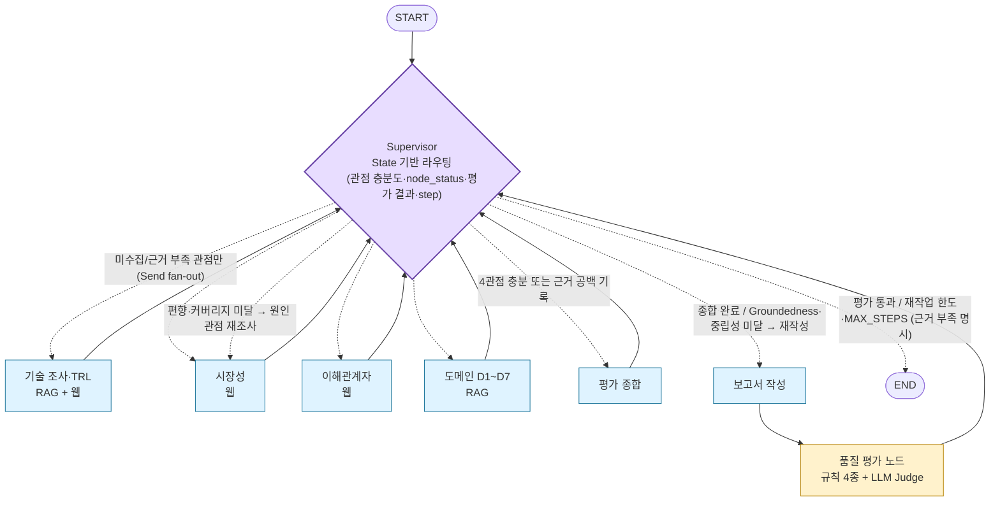

# Subject

KV cache 최적화 기술을 소프트웨어(DeepSeek-V2 MLA)·하드웨어(ITME) 두 진영에서 선정하여, 기술 성숙도(TRL)·시장성·이해관계자·도메인 적용성 4관점에서 근거 중심으로 평가하는 Supervisor 기반 Multi-Agent 시스템.

## Overview

- Objective : 두 기술을 4개 관점에서 비교 평가하되, 우승 기술을 고르지 않고 관점별 장점·제약·근거 수준·도입 전 확인사항을 근거와 함께 제시
- Method : Multi-Agent(**Supervisor**) + Agentic RAG + 웹 검색
- Tools : LangGraph(StateGraph·`Send`·SqliteSaver), FAISS + BM25(RRF), Tavily Web API, LangSmith, pdfplumber
- **Pattern : Supervisor** — 단일 `supervisor` 노드가 State를 읽고 `add_conditional_edges` 하나로 다음 에이전트를 고른다. 모든 하위 에이전트는 실행 후 Supervisor로만 돌아온다(에이전트 간 직접 엣지 0개, `tests/test_graph_structure.py`로 강제).
- **선정 이유** : 이 과제의 핵심 요구는 "관점별 근거 충분성 판단 → 부족한 관점만 재조사"와 "품질 평가 미달 원인에 따라 다른 에이전트로 되돌리기"다. Distributed(단계 체인)는 순서가 엣지에 묶여 특정 관점만 다시 부를 수 없고, Hierarchical(팀 단위 하위 Supervisor)은 에이전트 6개 규모에서 조정 계층만 늘린다. 한 곳에서 State 전체를 보고 다음 노드를 정하는 Supervisor가 요구에 가장 직접 대응한다.
- **동적 처리** : 실행 순서를 하드코딩하지 않는다. Supervisor는 매 진입마다 `perspective_status`·`node_status`·`retry_counts`·`eval_result`·`step_count`만 보고 결정한다.
  - 미수집 4관점을 `Send`로 동시에 fan-out(기술 조사 결과를 다른 관점이 입력으로 쓰지 않으므로 선행을 강제하지 않음)
  - `sufficient=False`인 관점만, 부족 항목(`missing`)을 재검색 질의로 넘겨 다시 부름 (예: 시장 근거 부족 → `dispatch:market`만)
  - 종합 에이전트가 특정 관점의 추가 근거를 요구하면 그 관점만 재조사
  - 품질 평가 미달 시 원인별 분기: 편향 통제·관점 커버리지 → 원인 관점 재조사 / Groundedness·중립성 → 보고서 재작성
  - 에이전트 예외는 `node_status=failed`로 기록되어 재시도, 한도를 넘으면 제외하고 "근거 부족"으로 보고서에 명시
  - 종료는 근거 충분성 + 품질 평가 통과로 한다. `MAX_STEPS`·재시도 상한·`recursion_limit`은 안전장치이며, 상한에 닿아도 근거 공백을 기록한 보고서를 만들고 정상 종료한다.
  - 모든 결정은 사유와 함께 `outputs/decisions_{trace_id}.jsonl`과 LangSmith(metadata `trace_id`)에 남는다.

## Selected Technologies

- SW : **DeepSeek-V2 MLA** (Multi-head Latent Attention, arXiv 2405.04434) — Key·Value를 저차원 잠재 벡터로 압축하도록 어텐션 구조 자체를 재설계한 기술. 원문 보고 기준 KV cache 93.3% 감소, vLLM·SGLang 등 서빙 생태계에서 MLA 백엔드를 지원
- HW : **ITME** (CXL-Hybrid 계층 메모리 확장, arXiv 2606.12556, SK hynix) — CXL 기반 DRAM-NVMe Hybrid Memory로 TB급 원격 메모리 계층을 구성하고, 가중치와 prefix KV cache의 예측 가능한 접근 패턴으로 데이터를 미리 이동
- HW 베이스라인 : InfiniGen, CXL-PNM (ITME 한계를 제3의 시각에서 교차 확인하는 용도로만 RAG에 적재)

## Features

- PDF 자료 기반 정보 추출 : 논문 4편(총 96p ≤ 200p) 페이지 단위 파싱, 인용 `[n, p.X]` 지원
- Agentic RAG : 질의 계획 → 하이브리드 검색 → 관련성 판정 → 관련 청크 2개 미만 시 질의 재작성(최대 2회) → 근거 기반 답변, 근거가 없으면 "근거 부족"
- Supervisor 동적 라우팅 : 부족 관점만 재조사, 품질 평가 원인별 재작업, 실패 fallback, 체크포인트 재개(`--resume`)
- **확증 편향 방지 전략**
  - HW 베이스라인 문서(InfiniGen, CXL-PNM)로 ITME의 한계를 교차 확인
  - 두 기술을 동일 형식(쟁점 / 관점 A 평가 / 관점 B 평가 / 엇갈리는 이유)으로 병기, 신호표·증거 균형표는 LLM이 아니라 코드가 State 판정값으로 생성
  - 종합 에이전트는 신규 검색 없이 검증된 Evidence만 사용
  - 품질 평가의 **편향 통제 규칙**: 기술·관점별 고유 출처 ≥ 2, 웹 근거의 단일 발행처 비중 ≤ 60%, 판정이 긍정·우려 한쪽뿐이면 해당 관점 재조사(반대 방향 근거 탐색). 재조사 후에도 없으면 숨기지 않고 "근거 부족"으로 7장에 명시
- **보고서 품질 평가 (Hybrid)** : 보고서 다음에 독립 노드 `quality_evaluator`가 4항목을 항목별로 판정한다. 규칙 검사(하드 게이트) 실패는 LLM Judge가 뒤집을 수 없다.

  | 항목 | 규칙 검사 | LLM Judge (`EvalVerdict`) | 미달 시 |
  |---|---|---|---|
  | Groundedness | 목차·인용·REFERENCE 검증(`validate_report`), 단위 있는 수치 문장 인용 필수, PDF 10p 이하 | 발췌가 주장을 뒷받침하는가 | 보고서 재작성 |
  | 중립성 | 우열·추천 표현 탐지(면책 문장 제외) | 암묵적 우열 판정 | 보고서 재작성 |
  | 편향 통제 | 고유 출처 ≥2, 단일 출처 비중 상한, 긍정·우려 양방향 | 한쪽 근거 편중 | 원인 관점 재조사 |
  | 관점 커버리지 | 4.1~4.4 서술·판정표, 두 기술 모두 기재 | 4관점 실질 서술 | 원인 관점 재조사 |

  항목별 `passed / score(1~5) / reason / target_agents`가 State `eval_result`와 `outputs/validation.json`에 저장된다.

## Tech Stack

| Category | Details |
|---|---|
| Framework | LangGraph 1.x (StateGraph, `Send`, `add_conditional_edges`), Python 3.11+ |
| Checkpoint | langgraph-checkpoint-sqlite `SqliteSaver` (thread_id = trace_id) |
| Observability | LangSmith (run_name `kv-eval-supervisor`, tags `pattern:supervisor`, metadata `trace_id`), 결정 로그 JSONL |
| LLM / Generator | gpt-5.6-terra (OpenAI Responses API, Pydantic 구조화 출력) |
| LLM / Judge | gpt-5.6-terra (품질 평가 `EvalVerdict`, 대체 모델 없음) |
| Retrieval | FAISS(Dense) + BM25(Sparse), RRF 융합, 기술별 문서 필터 — 92케이스 **Hit@1 0.84 / Hit@3 0.99 / Hit@6 1.00 / MRR 0.92**, 필수 용어 커버리지 0.92 (`outputs/retrieval_eval.json`) |
| Embedding | Qwen3-Embedding-0.6B (다국어·교차언어 검색) |
| Web Search | Tavily API (시장·이해관계자 평가, TRL 7~9 상용화 근거) |
| Test | pytest + Fake LLM·Web·RAG (API 키 불필요) |

## Agents

조정 계층(`src/kv_eval/supervisor/`, `src/kv_eval/evaluation/`)과 하위 에이전트(`src/kv_eval/agents/`)를 분리했다. 하위 에이전트는 Supervisor를 import하지 않는다.

- **Supervisor** : State 제어 필드로 다음 노드 결정(`policy.decide`), 결정 로그 기록, 재시도·제외·종료 판단
- **Quality Evaluator** : 보고서 4항목 Hybrid 평가(규칙 + LLM Judge), 미달 원인 에이전트 지정
- 기술 조사 에이전트 `tech` (RAG + 웹) : MLA·ITME 기술 개요·성능·한계, TRL(논문 → 1~6, 상용화 웹 근거 → 7~9)
- 시장 평가 에이전트 `market` (웹) : 시장 규모·성장, 상용화·채택, 생태계 지지(M1~M3, 긍정/우려/혼재)
- 이해관계자 평가 에이전트 `stakeholder` (웹) : 경쟁 진영·도입 기업/개발자·투자 업계의 귀속된 발언(S1~S3)
- 도메인 평가 에이전트 `domain` (RAG) : 데이터센터·클라우드 장문맥 서빙 D1~D7(적합/조건부/제약/근거 부족)
- 평가 종합 에이전트 `synthesis` : 4관점 일치·상충·근거 공백 정리(신규 검색 없음), 필요 시 추가 근거가 필요한 관점 지목
- 보고서 생성 에이전트 `report` : SUMMARY~REFERENCE 보고서, 신호표·증거 균형표·근거 공백 절은 코드가 생성

## State Schema

`src/kv_eval/state.py` — 제어(control)와 페이로드(payload)를 분리했다.

| 구분 | 필드 | reducer |
|---|---|---|
| 제어 | `trace_id`, `step_count`, `next_agents`, `status` | 단일 작성자(Supervisor) |
| 제어 | `perspective_status`, `node_status`, `retry_counts`, `last_error`, `feedback` | 키 단위 dict merge |
| 제어 | `eval_result`, `last_decision` | 단일 작성자 |
| 제어 | `gaps` (근거 공백) | 순서 유지 중복 제거 append |
| 페이로드 | `perspectives{tech, market, stakeholder, domain}` | 키 단위 dict merge |
| 페이로드 | `synthesis`, `report` | 단일 작성자 |
| 페이로드 | `evidence` | dedup-append + 발췌 1,600자 상한 |
| 페이로드 | `cache_keys` (RAG 캐시 위치, 원문은 디스크) | 키 단위 dict merge |

설계 항목별 선정 이유 (전체 결정 기록: `docs/DECISIONS.md`)

1. **제어 vs 페이로드 분리** : 한 딕셔너리에 섞으면 라우팅 조건이 결과 본문 구조에 의존해 프롬프트를 바꿀 때 라우팅이 깨지므로, Supervisor가 제어 필드와 결과의 `sufficient/missing`만 읽도록 분리했다.
2. **관측성 위치** : 로그를 State의 `operator.add` 리스트에 쌓으면 체크포인트마다 전체 이력이 복제되어 커지므로, 결정 로그 본문은 `outputs/decisions_{trace_id}.jsonl`과 LangSmith에 두고 State에는 직전 결정(`last_decision`)만 남겼다.
3. **지속성 비용** : 원문 RAG 캐시를 State에 넣으면 `final_state.json`이 848KB까지 커지고 체크포인트마다 저장되므로, 캐시는 `data/cache/{trace_id}/` 디스크에 두고 State에는 `cache_keys`만, `evidence`는 발췌 길이 상한과 dedup reducer로 관리했다.
4. **상관** : 키를 따로 쓰면 트레이스·State·로그를 사람이 손으로 맞춰야 하므로, uuid4 `trace_id` 하나를 LangGraph `thread_id`·LangSmith metadata·결정 로그 파일명에 함께 썼다.
5. **재개/복구** : 메모리 체크포인터는 프로세스가 죽으면 사라져 15분짜리 실행을 처음부터 다시 해야 하므로, `SqliteSaver`와 `node_status{pending/running/done/failed/skipped}`·`last_error`·`retry_counts`로 실패 지점부터 `--resume`하게 했다.
6. **동시 처리** : reducer 없이 `Send`로 병렬 실행하면 같은 키에 동시에 쓸 때 `InvalidUpdateError`가 나거나 마지막 값만 남으므로, 필드별 병합 규칙(dict merge, dedup-append)을 명시했다.
7. **종료 보장** : `recursion_limit`만 두면 상한에 걸릴 때 예외로 죽어 보고서가 남지 않으므로, Supervisor가 `step_count > MAX_STEPS`를 먼저 감지해 근거 공백을 명시하고 보고서까지 만든 뒤 정상 종료하게 했다(재시도 상한·`recursion_limit`은 2·3차 안전장치).

## Architecture


`outputs/architecture.png`는 `python scripts/export_graph.py`가 **컴파일된 그래프**(`graph.get_graph()`)에서 생성한다(mermaid.ink에 접근할 수 없으면 실제 노드·엣지를 로컬에서 그림, Mermaid 원문은 `outputs/architecture.mmd`). 점선은 Supervisor의 conditional edge, 실선은 고정 엣지다.


```mermaid
flowchart TD
    START([START]) --> SUP{"Supervisor<br/>State 기반 라우팅<br/>(관점 충분도·node_status·평가 결과·step)"}
    SUP -. "미수집/근거 부족 관점만 (Send fan-out)" .-> TECH["기술 조사·TRL<br/>RAG + 웹"]
    SUP -.-> MARKET["시장성<br/>웹"]
    SUP -.-> STAKE["이해관계자<br/>웹"]
    SUP -.-> DOMAIN["도메인 D1~D7<br/>RAG"]
    TECH --> SUP
    MARKET --> SUP
    STAKE --> SUP
    DOMAIN --> SUP
    SUP -. "4관점 충분 또는 근거 공백 기록" .-> SYN["평가 종합"]
    SYN --> SUP
    SUP -. "종합 완료 / Groundedness·중립성 미달 → 재작성" .-> REPORT["보고서 작성"]
    REPORT --> EVAL["품질 평가 노드<br/>규칙 4종 + LLM Judge"]
    EVAL --> SUP
    SUP -. "편향·커버리지 미달 → 원인 관점 재조사" .-> MARKET
    SUP -. "평가 통과 / 재작업 한도·MAX_STEPS (근거 부족 명시)" .-> END([END])

    classDef sup fill:#e8ddff,stroke:#6842a6,stroke-width:2px;
    classDef agent fill:#dff3ff,stroke:#20789d;
    classDef gate fill:#fff2cc,stroke:#b8860b;
    class SUP sup;
    class TECH,MARKET,STAKE,DOMAIN,SYN,REPORT agent;
    class EVAL gate;
```

실행 예시(Fake 시나리오, 시장 근거 1회 부족): `dispatch:tech,market,stakeholder,domain` → `dispatch:market` → `synthesis` → `report` → `quality_evaluator: pass` → `end:passed`.

## Data Preprocessing

파싱(pdfplumber 좌표 기반, 2단 레이아웃 읽기 순서 재정렬) → header/footer 제거 → 표 분리 → 참고문헌 **구간**만 제외(DeepSeek-V2 Appendix A~G의 MLA 수식·ablation은 색인 유지) → 청킹(1,200자/겹침 200자, 문단 경계 보존) → 페이지 예산(≤200p) 검증. 결과는 `data/processed/chunks.jsonl`(359청크)·`summary.json`.

| 항목 | 설계서 기재 | 실측 | 차이 원인 |
|---|---|---|---|
| 파싱 도구 | pypdf | pdfplumber | 2단 레이아웃·표 좌표 처리 |
| 참고문헌 제외 | 11p | 14p | References 구간을 실제 탐지 |
| 색인 페이지 | 85p | 84p | 위 탐지 결과 (총 96p ≤ 200p 동일) |
| 청크 수 | 333개 | 359개 | 큰 표를 행 단위로 분할 |

깨진 수식 줄 정제는 92케이스 A/B 측정으로 기본 OFF다(ON: Hit@1 0.86·필수 용어 커버리지 0.75 FAIL / OFF: Hit@1 0.84·커버리지 0.92 PASS).

## Retrieval Evaluation

LLM 생성 없이 검색기(FAISS + BM25 → RRF)만 평가한다. 정답 기준은 `doc_id`(+ 정밀 케이스는 페이지·필수 용어).

```bash
python -m eval.evaluate_retrieval              # 지표 + 합격 기준 판정
python -m eval.evaluate_retrieval --show-hits  # 케이스별 검색 결과
```

- 평가 세트 `eval/retrieval_cases.json` 92케이스(정밀 12 + 문서별 coverage 80), 결과 `outputs/retrieval_eval.json`
- Hit@1 0.84 · Hit@3 0.99 · Hit@6 1.00 · MRR 0.92 · 기대 페이지 적중률 0.92 · 노이즈율 0.00 → 합격 기준 전부 통과

## Directory Structure

```
├── app.py                         # CLI: 실행 / --resume <trace_id> / --report-only / --export-only
├── pyproject.toml                 # 의존성 단일 출처 (dev extras: pytest)
├── requirements.txt               # pip -r 호환용(-e .)
├── .env.example                   # OpenAI·Tavily·LangSmith 키 템플릿
├── data/
│   ├── manifest.json              # 문서 4편 메타데이터(진영/역할/참고문헌 구간)
│   ├── raw/                       # 원문 PDF 4편
│   └── processed/                 # chunks.jsonl, summary.json
├── preprocessing/                 # 파싱·header/footer·표·참고문헌 구간·청킹·페이지 예산
├── src/kv_eval/
│   ├── config.py                  # 모델·검색·재시도 상한·MAX_STEPS·보고서 파일명
│   ├── state.py                   # State Schema(제어/페이로드) + reducer
│   ├── graph.py                   # Supervisor 그래프 조립(단일 conditional edge)
│   ├── observability.py           # trace_id, 결정 로그 JSONL, LangSmith run 설정
│   ├── supervisor/                # 조정 계층: policy(결정) · router(라우팅) · guard(실패 처리)
│   ├── evaluation/quality.py      # 품질 평가 노드(규칙 4종 + LLM Judge)
│   ├── agents/                    # 하위 에이전트: technology, market, stakeholder, domain, synthesis, report
│   ├── rag/                       # ingest · index · retrieve(RRF) · workflow(Agentic RAG) · cache(디스크 캐시)
│   ├── tools/                     # Tavily 웹 검색, 재검색 질의(retry_queries)
│   ├── reporting/                 # 목차·인용·10p 검증(sections), Markdown/PDF 내보내기(export)
│   ├── llm.py · prompts.py · schemas.py
├── prompts/                       # 공통 계약(00) + 역할별 프롬프트(01~08) + 품질 평가(09)
├── schemas/evidence.schema.json   # Evidence 공통 구조
├── eval/                          # 검색 품질 평가 세트·하네스
├── tests/                         # Fake LLM·Web·RAG 시나리오 테스트
├── scripts/                       # export_graph.py(그래프 이미지), validate_prompt_package.py
├── docs/                          # DEV_PLAN.md, DECISIONS.md
└── outputs/                       # 보고서, validation.json, decisions_*.jsonl, architecture.png, 이전 과제 산출물(RAG-Output_*)
```

## Usage

### 1. 설치

```bash
pip install -e ".[dev]"        # 의존성의 단일 출처는 pyproject.toml
cp .env.example .env           # OPENAI_API_KEY, TAVILY_API_KEY, LANGSMITH_API_KEY 입력 (.env는 git 제외)
```

### 2. 실행

```bash
python app.py                        # 새 실행: trace_id 발급 → 그래프 실행 → 보고서·검증 저장
python app.py --resume <trace_id>    # 중단된 실행을 SQLite 체크포인트에서 이어서 (완료 노드는 재실행 안 함)
python app.py --report-only          # 직전 결과로 보고서 → 품질 평가 루프만 (새 검색 없음)
python app.py --export-only          # LLM 호출 없이 검증·Markdown/PDF 내보내기만
```

실행 중에는 노드별 진행과 Supervisor 결정 사유(`supervisor#3 → dispatch:market (market: 근거 부족 재조사 1/2 ...)`)가 출력된다. `LANGSMITH_TRACING=true`와 키가 있으면 LangSmith 프로젝트에 같은 `trace_id`로 기록된다.

| 산출물 (`outputs/`) | 내용 |
|---|---|
| `Agent_판교_9반_김민정_김태동_임동건_김동욱_이재겸_박규리.md` / `.pdf` | 최종 보고서(SUMMARY ~ REFERENCE, ≤ 10p) |
| `validation.json` | 목차·인용·10p 검증, 품질 평가 4항목, 근거 공백, trace_id, 재시도 횟수 |
| `decisions_{trace_id}.jsonl` / `run_logs.json` | Supervisor·평가 결정 로그 `{trace_id, step, node, decision, reason, ts}` |
| `final_state.json` | 최종 State(원문 캐시 제외) — `--export-only`·`--report-only` 입력 |
| `checkpoints.sqlite` | LangGraph 체크포인트(`--resume`용, git 제외) |
| `architecture.png` / `.mmd` | 컴파일 그래프 이미지 (`python scripts/export_graph.py`) |
| `RAG-Output_…` | 이전 과제(Agentic RAG) 제출물 — 수정하지 않음 |

종료 코드: 품질 평가 통과 `0`, 보고서는 생성됐으나 미검증 `2`, 실행 실패 `1`. 종료 상태는 `completed`(통과·공백 없음) / `completed_with_gaps`(통과·근거 공백 명시) / `unverified`(평가 미통과).

### 3. 테스트 (API 키 불필요)

```bash
python -m pytest -q                       # 정상·관점 재작업·평가 미달 루프·상한 종료·재개·예외 fallback·엣지 검사
python scripts/export_graph.py            # outputs/architecture.png 생성
python scripts/validate_prompt_package.py # 프롬프트 패키지 정적 검증
```

## Contributors

| 이름 | 수행 역할 |
|---|---|
| 김동욱(P280) | 전체 시스템 아키텍처 설계 — LangGraph 기반 State(state.py)·Graph 노드/엣지 배선(graph.py), 실행 설정(config.py) 등 전체 골격 구성 |
| 김민정(P282) | 데이터 전처리 — 논문 PDF 파싱, 2단 컬럼 분리, 참고문헌 구간 제외, 청킹 파이프라인 구현(preprocessing/) |
| 김태동(P287) | API 툴 정리 — 시장·이해관계자 평가 Agent용 Tavily 웹 검색 도구 구현(tools/web_search.py) |
| 박규리(P289) | 데이터 전처리(파싱·참고문헌 구간 제외·청킹), 임베딩·벡터 색인, 검색 품질 평가 세트 및 하네스 |
| 이재겸(P298) | 페르소나 및 프롬프트 작성 — Agent별 System/Task 프롬프트 패키지(prompts/), 공통 계약·Evidence 스키마 설계 |
| 임동건(P301) | vector DB 구성(박규리님과 공동) — 초기 Chroma 기반 벡터DB 셋업 및 검증(이후 FAISS + BM25 하이브리드 색인으로 통합) |
