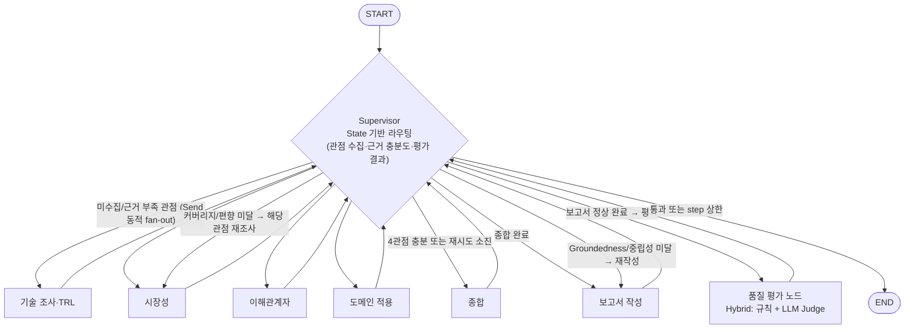

# Multi-Agent Orchestration 개선 개발 계획서

> 2026-10-07 개정: report→supervisor 경로, QA D-03 반영 — PM 승인

- 작성: TF팀 PM · 작성일 2026-10-07 · 작업 브랜치 `feat/multi-agent-supervisor` (`main`의 RAG 산출물과 분리)
- 기준 문서: Notion「Multi-Agent Orchestration」 가이드 A~D, 제출물 3종, 토글「(참고) 평가 항목」
- 대상 저장소: `gyudren/kv-cache-optimization` @ `main` (1896b1c, "[산출물 최종] (#10)")

---

## 1. 요약

| 항목 | 결론 |
|---|---|
| 패턴 | **Supervisor**를 선정한다. 기존 `master` 게이트 구조를 살리면서 "근거 충분성 판단 → 재조사 루프" 요구를 바로 만족시킬 수 있다. |
| 핵심 결함 | 현재 그래프는 `기술 → 3관점 → 종합 → 보고서` 순서가 **엣지로 하드코딩**되어 있다. 가이드의 "순서 하드코딩 금지"를 위반한다. |
| State 결함 | `trace_id`·`step_count`·`node_status`·`last_error`가 없다. 로그와 `rag_cache`가 State 안에서 무한히 쌓인다(`final_state.json` 848KB). 체크포인터가 없어 중단 후 재개가 불가능하다. |
| 품질 평가 결함 | `master_report_gate`가 목차·인용 검사와 범용 LLM 검수만 한다. 가이드 D의 4개 항목(Groundedness·중립성·편향 통제·관점 커버리지)을 **항목별로 판정하는 독립 노드가 없다**. |
| 제출물 결함 | LangSmith 트레이싱 설정이 없고, README가 Agent 과제 템플릿(Pattern·동적 처리·State Schema 7항목)을 따르지 않는다. 보고서 파일명도 `RAG-Output_…`이다. |
| 운영 방식 | Engineer → QA → PM 승인의 반복 루프를 돈다. QA는 매 반복마다 아래 §4의 100점 루브릭으로 채점하고, **전 항목 만점 판정이 나올 때까지** 반복한다. |

---

## 2. 현황 진단 — 평가 항목 대비 갭 분석

배점은 Notion 토글「(참고) 평가 항목」 기준이다. 현재 점수는 PM 추정치다.

| 평가 항목 (배점) | 현재 코드 근거 | 갭 | 예상 현재 점수 |
|---|---|---|---|
| 패턴 적용 정합성 (20) | `graph.py` — `master_init → technology` 고정 엣지, `master_dispatch`가 항상 3관점 고정 할당(`master.py` `PERSPECTIVES`) | 라우팅이 State가 아니라 `phase` 순서에 묶여 있다. 단일 Supervisor 라우터가 없다. | 8 |
| 동적 동작 실증 (20) | `run_logs.json`: 재작업 루프는 실제로 발생(tech 재작성 2회, 관점 재할당 2회) | LangSmith 트레이스가 없어 **제출 증빙이 불가능**하다. 라우팅 사유가 기록되지 않는다. | 6 |
| State Schema 설계 (20) | `state.py` `GraphState` 14개 필드 | 제어와 페이로드가 섞여 있다. 상관 키·종료 카운터·재개 정보가 없다. `logs`와 `rag_cache`가 무한히 증가한다. | 6 |
| 품질 평가 노드 (15) | `master_report_gate_node` (결정적 검사 + LLM 검수, 재시도 2회) | 4개 평가 항목이 구조화되어 있지 않다. 미달 원인별로 경로를 나누지 않는다(항상 보고서 재작성). | 7 |
| 코드 구조·모듈 분리 (5) | `agents/`에 조정 계층(master)과 하위 에이전트가 함께 있다. | 조정 계층을 분리하고 README 디렉터리 구조와 맞춰야 한다. | 3 |
| 실행 결과 재현성 (10) | `recursion_limit=100`, 재시도 상한 있음. 테스트 없음. | API 키 없이 흐름을 검증할 테스트가 없다. 트레이스와 대조할 근거가 없다. | 5 |
| Output 보고서 (10) | SUMMARY·REFERENCE 포함, 10p PDF | 파일명·표지를 Agent 과제 규격으로 바꾸고, 평가 결과를 반영해야 한다. | 8 |
| **합계 (100)** | | | **≈43** |

---

## 3. 목표 아키텍처 (Supervisor)

설계 규칙 (가이드 B 필수 항목과 1:1 대응):

1. 모든 하위 에이전트(보고서·품질 평가 노드 포함)는 실행 후 **Supervisor로만 돌아온다**. 작업 노드끼리 잇는 엣지는 0개이고, 테스트로 강제한다. (반복 2, QA D-03 반영: `report → quality_evaluator` 고정 엣지 제거)
2. Supervisor는 하나의 `add_conditional_edges(supervisor, route)`로 다음 노드를 정한다. 판단 입력은 `perspective_status`·`retry_counts`·`eval_result`·`step_count`이고, 고정된 실행 순서는 없다.
3. **고정 스텝 수로 끝내지 않는다.** 4관점 충분성(Supervisor 판정)과 품질 평가 통과로 종료하며, `step_count`와 관점별 재시도 상한은 안전장치로만 쓴다.
4. 근거 부족 시 **해당 하위 에이전트만** 재작업시킨다. 부족 항목(`missing`)을 재검색 질의로 넘긴다(기존 `retry_queries` 재사용).
5. 품질 평가 미달 원인에 따라 경로를 나눈다. 관점 커버리지·편향 통제 실패는 원인 관점 에이전트를 다시 부르고, Groundedness·중립성 실패는 보고서를 다시 쓴다.

---

## 4. 구현 백로그 (Engineer 담당 · QA 검증 기준 포함)

| ID | 작업 | 대상 파일 | 완료 기준 (QA 검증 포인트) | 관련 배점 |
|---|---|---|---|---|
| E1 | 조정 계층 분리: `supervisor/`(router, policy, decision log)와 하위 에이전트 분리 | `src/kv_eval/supervisor/`, `agents/` | `agents/*`가 `supervisor`를 import하지 않음. 디렉터리가 README와 일치 | 코드 구조 5 |
| E2 | 단일 Supervisor 노드 + `add_conditional_edges` 라우팅. 관점 선택은 `Send` 동적 fan-out | `graph.py`, `supervisor/router.py` | 그래프 엣지 검사 테스트에서 에이전트 간 직접 엣지 0개. 라우팅 결과가 State 입력만으로 결정됨 | 패턴 20 |
| E3 | 근거 충분성 평가 → 재작업 요청(부족 관점만, 부족 항목 전달) | `supervisor/policy.py` | Fake LLM으로 "market 부족" 시나리오를 돌리면 market만 재호출됨 | 패턴 20, 동적 20 |
| E4 | State 재설계 (§5) — 제어·페이로드 분리, reducer, `trace_id`, `step_count`, `node_status`, `last_error` | `state.py` | §5 표의 7항목이 코드 주석과 README에 대응. `rag_cache`와 로그 본문을 State에서 제거 | State 20 |
| E5 | 관측성: 결정 로그 `{trace_id, step, node, decision, reason, ts}`를 외부 JSONL과 LangSmith 메타데이터로 적재 | `observability.py`, `app.py` | `outputs/decisions_{trace_id}.jsonl` 생성. LangSmith run의 metadata에 동일 `trace_id` | State 20, 동적 20 |
| E6 | 재개·복구: `SqliteSaver` 체크포인터(thread_id=`trace_id`), `python app.py --resume <trace_id>` | `app.py`, `pyproject.toml` | 실행 중 강제 중단 후 resume 시 완료된 노드를 다시 실행하지 않음(테스트) | State 20, 재현성 10 |
| E7 | 실패 처리: 에이전트 예외를 `node_status=failed`, `last_error`로 기록. Supervisor가 재시도하고, 상한을 넘으면 제외한 뒤 근거 공백으로 명시 | `supervisor/policy.py`, 각 agent 래퍼 | 예외를 주입한 테스트에서 그래프가 죽지 않고 보고서 한계점에 기록됨 | 패턴 20 |
| E8 | 품질 평가 노드 (Hybrid): 규칙 검사 4종과 LLM Judge `EvalVerdict` 4항목 | `evaluation/quality.py`, `schemas.py`, `prompts/09_quality_evaluator.md` | 4항목별 `passed/score/reason/target`이 State에 저장됨. 미달 시 Supervisor 루프로 돌아감 | 품질 15 |
| E9 | 종료 보장: `MAX_STEPS`, 관점별·보고서 재시도 상한, `recursion_limit` 3중 가드 | `config.py`, `supervisor/router.py` | 항상 부족을 반환하는 Fake로 돌려도 유한 스텝 안에 END 도달(테스트) | 재현성 10 |
| E10 | LangSmith 트레이싱: `LANGSMITH_TRACING`, project, run_name, tags(`pattern:supervisor`) | `.env.example`, `app.py` | 실제 실행 1회의 트레이스 캡처 `tracing-1.png…` 제출 | 동적 20 |
| E11 | 그래프 이미지 자동 생성 `outputs/architecture.png` (`draw_mermaid_png`) | `scripts/export_graph.py` | README Architecture에 실제 컴파일 그래프 이미지 | 제출물 |
| E12 | 오프라인 테스트: Fake LLM·Web·RAG로 4개 시나리오(정상, 관점 재작업, 평가 미달 루프, 상한 종료) | `tests/` | `pytest` 통과(API 키 불필요) | 재현성 10 |
| E13 | 보고서 규격: 파일명 `Agent_판교_9반_{이름들}`, 최대 10p 검사, SUMMARY·REFERENCE 필수 | `config.py`, `reporting/` | `validate_report`에 페이지 수 검사 포함 | 보고서 10 |
| E14 | README를 Agent 템플릿으로 재작성(핑크 항목 필수), 구현 선정 이유를 한 줄씩 작성 | `README.md` | §6 체크리스트 전부 충족 | 전 항목 |

우선순위: E4 → E2·E3 → E9 → E8 → E5·E6·E7 → E12 → E10·E11 → E13·E14 (State가 다른 작업의 계약이므로 가장 먼저 확정한다)

---

## 5. State Schema 설계안과 선정 이유 (가이드 C)

각 항목은 "다른 안으로 하면 어떻고, 그래서 이것을 선정했다" 형식의 한 줄로 README에 옮긴다.

| 항목 | 설계 | 선정 이유 (한 줄) |
|---|---|---|
| 제어 vs 페이로드 분리 | 제어: `trace_id, step_count, next_agents, perspective_status, retry_counts, node_status, last_error, eval_result`. 페이로드: `perspectives{tech,market,stakeholder,domain}, synthesis, report, evidence` | 한 딕셔너리에 섞으면 라우팅 조건이 결과 본문 구조에 의존해 프롬프트를 바꿀 때 라우팅이 깨지므로, Supervisor는 제어 필드만 읽도록 분리했다. |
| 관측성 위치 | 결정 로그(사유 포함)는 외부 JSONL과 LangSmith에 둔다. State에는 마지막 결정 1건(`last_decision`)만 둔다. | 로그를 State의 `operator.add` 리스트에 쌓으면 체크포인트마다 전체 이력이 복제되어 커지므로, 본문은 외부로 빼고 라우팅에 필요한 직전 결정만 남겼다. |
| 지속성 비용 | `rag_cache`와 웹 원문은 `data/cache/{trace_id}/` 디스크에 두고 State에는 키만 둔다. `evidence`는 발췌 길이를 제한하고 dedup reducer로 병합한다. | 현재처럼 원문 캐시를 State에 넣으면 `final_state.json`이 848KB까지 커지고 체크포인트마다 저장되므로, 대용량 데이터는 외부 저장소에 두고 참조 키만 남겼다. |
| 상관 | `trace_id`(uuid4) = LangGraph `thread_id` = LangSmith metadata = 로그 파일명 | 키를 따로 쓰면 트레이스와 State와 로그를 사람이 손으로 맞춰야 하므로, 하나의 ID로 세 저장소를 모두 잇도록 했다. |
| 재개/복구 | `SqliteSaver` 체크포인터, `node_status{agent: pending/running/done/failed}`, `last_error`, `retry_counts` | 메모리 체크포인터는 프로세스가 죽으면 사라지고 15분짜리 실행을 처음부터 다시 해야 하므로, 파일 기반 체크포인터와 노드 상태로 실패 지점부터 재개하게 했다. |
| 동시 처리 | `perspectives`는 키 단위 merge reducer, `evidence`는 dedup-append reducer, `node_status`·`retry_counts`는 dict merge reducer | reducer 없이 `Send`로 병렬 실행하면 같은 키에 동시에 쓸 때 `InvalidUpdateError`가 나거나 마지막 값만 남으므로, 필드별 병합 규칙을 명시했다. |
| 종료 보장 | `step_count`(Supervisor 진입마다 +1, `MAX_STEPS`), 관점별·보고서 재시도 상한, `recursion_limit` | `recursion_limit`만 두면 상한에 걸릴 때 예외로 죽어 보고서가 남지 않으므로, Supervisor가 먼저 상한을 감지해 "근거 부족"을 명시하고 정상 종료하게 했다. |

---

## 6. 품질 평가 노드 설계 (가이드 D) — 3안 Hybrid 선정

| 평가 항목 | 규칙 검사 (결정적) | LLM Judge (구조화 `EvalVerdict`) | 미달 시 경로 |
|---|---|---|---|
| Groundedness | 모든 인용이 Evidence 카탈로그에 존재(기존 `validate_report` 재사용). 수치 문장에 인용 필수 | 인용된 발췌가 주장을 실제로 뒷받침하는지 | 보고서 재작성 |
| 중립성 | 우열·추천 표현 금지어 탐지(추천, 우월, 승자, 더 낫다 등) | 문맥상 암묵적 우열 판정 여부 | 보고서 재작성 |
| 편향 통제 | 기술·관점별 고유 출처 ≥2, 단일 출처 비중 상한, 긍정·우려 근거 모두 존재 | 한쪽 근거만 편중했는지 | 원인 관점 재조사 |
| 관점 커버리지 | 4.1~4.4 섹션과 판정 표가 비어 있지 않음, 두 기술 모두 기재 | 4관점이 실질적으로 서술됐는지 | 원인 관점 재조사 |

선정 이유: 1안(형식만 검사)은 결정적이지만 "근거가 주장을 실제로 뒷받침하는가"를 볼 수 없다. 2안(LLM Judge만)은 유연하지만 실행마다 판정이 바뀐다. 그래서 규칙 검사를 하드 게이트로, LLM Judge를 내용 게이트로 쓰는 3안을 선정했다. 규칙 검사 실패는 LLM이 뒤집을 수 없다.

---

## 7. 팀 운영 방식 (서브에이전트)

| 역할 | 정의 파일 | 책임 | 산출물 |
|---|---|---|---|
| PM | (본인) | 요구사항 확정, 우선순위, 승인·반려 | 본 계획서, 반복별 승인 기록 |
| Python Senior Engineer | `.claude/agents/python-senior-engineer.md` | 백로그 E1~E14 구현, 기능 오류 0, 모든 구현에 "선정 이유 한 줄" 작성 | 커밋, `docs/DECISIONS.md` |
| QA Senior | `.claude/agents/qa-senior.md` | 매 반복마다 평가 항목 100점 루브릭으로 채점·검증. 증거(파일:라인, 테스트 결과)가 없으면 감점 | `docs/QA_REPORT.md` (항목별 점수·결함 목록) |

반복 루프: Engineer가 구현하면 QA가 채점한다. 만점이 아닌 항목이 있으면 결함 목록을 Engineer에게 되돌린다. 전 항목 만점이 나오면 PM이 승인한다. 반복 상한은 5회로 두고, 이를 넘으면 PM이 범위를 다시 조정한다.

---

## 8. 일정 (마감: DAY 2 퇴근 전)

| 시점 | 마일스톤 | 완료 조건 |
|---|---|---|
| DAY 1 오전 | M1: State·Supervisor 골격 (E1·E2·E4·E9) | 오프라인 테스트로 라우팅·종료 확인 |
| DAY 1 오후 | M2: 재작업·품질 평가·실패 처리 (E3·E7·E8) | QA 1차 채점 ≥ 80 |
| DAY 2 오전 | M3: 관측성·재개·트레이싱·테스트 (E5·E6·E10·E12) | 실 API 1회 실행, 트레이스 캡처 |
| DAY 2 오후 | M4: 보고서·README·제출 패키징 (E11·E13·E14) | QA 100점, zip `Agent_판교_9반_{이름들}.zip` |

---

## 9. 리스크와 PM 확인 필요 사항

| 구분 | 내용 | 대응 |
|---|---|---|
| 차단 | 이 클라우드 세션은 `gyudren/kv-cache-optimization`에 **push 권한이 없다**(Claude GitHub App 미설치). | 조직 관리자가 App을 설치하거나, 로컬 세션에서 push한다. |
| 차단 | 실제 실행에는 `OPENAI_API_KEY`·`TAVILY_API_KEY`·`LANGSMITH_API_KEY`가 필요하다. | 환경 시크릿으로 등록하거나 로컬에서 실행한다. 오프라인 테스트는 키 없이 진행한다. |
| 품질 | 실 실행 1회가 약 15분 걸리고, LLM이 비결정적이다. | Fake 기반 테스트로 흐름을 보장하고, 실 실행은 트레이스 증빙 용도로 1~2회만 한다. |
| 범위 | 기존 RAG 산출물(`outputs/RAG-Output_*`)은 이전 과제 제출물이다. | 덮어쓰지 않고, Agent 산출물은 새 파일명으로 생성한다. |
